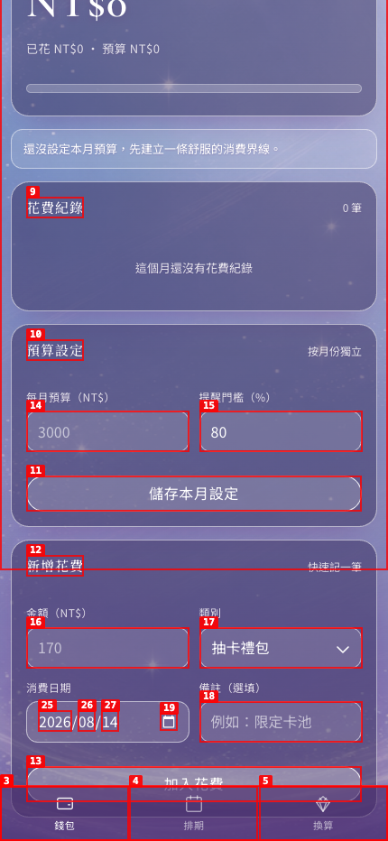
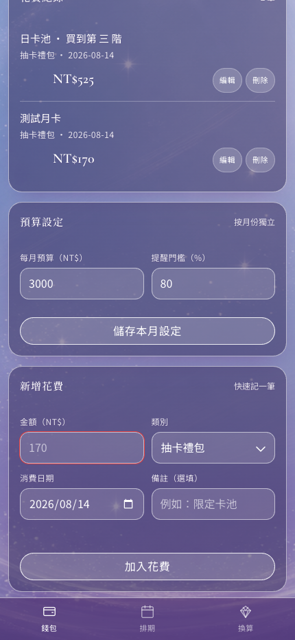

# Dogfood Report: 深空省省 Expo Web

| Field | Value |
|---|---|
| Date | 2026-08-14 |
| App URL | `http://127.0.0.1:8081` |
| Session | `lad-web-launch` |
| Scope | Full local Web app; all tabs, core financial flow, persistence, responsive and accessibility states |

## Summary

| Severity | Count |
|---|---:|
| Critical | 0 |
| High | 0 |
| Medium | 0 open / 1 fixed |
| Low | 0 |
| **Open** | **0** |

## Issues

### ISSUE-001: Empty expense submission fails silently

| Field | Value |
|---|---|
| Severity | medium |
| Status | fixed and browser-verified |
| Category | functional / UX / accessibility |
| URL | `http://127.0.0.1:8081/wallet` |
| Repro Video | `videos/issue-001-repro.webm` |

**Description**

Pressing 「加入花費」 with an empty amount leaves the form unchanged and provides no inline error, status announcement, or recovery guidance. A user cannot tell whether the control worked. The expected behavior is an adjacent, screen-reader-announced instruction explaining that the amount must be greater than zero.

**Repro Steps**

1. Open a clean wallet with the expense amount empty.
   

2. Press 「加入花費」.

3. Observe that the screen remains unchanged and no error is announced.
   

**Resolution**

The form now keeps the user-entered values and renders `請輸入大於 0 的花費金額。` in an adjacent `role="alert"` region. Persistence failures also leave the form intact and explain that the expense has not been saved.

